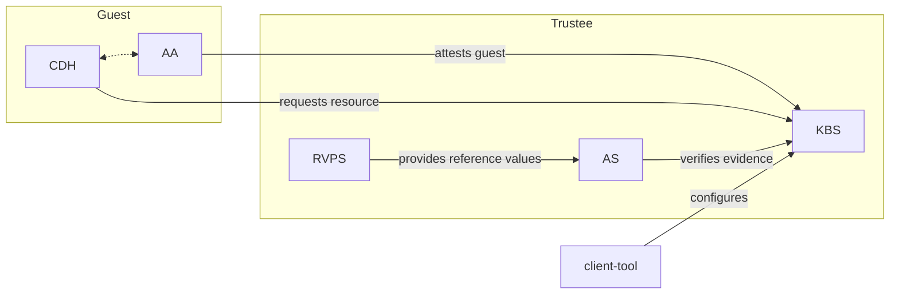

# Trusted Components for Attestation and Secret Management

[](https://app.fossa.com/projects/git%2Bgithub.com%2Fconfidential-containers%2Fkbs?ref=badge_shield)

This repository contains tools and components for attesting confidential guests and providing secrets to them.
Collectively, these components are known as Trustee.
Trustee typically operates on behalf of the guest owner and interact remotely with
[guest components](https://github.com/confidential-containers/guest-components).

Trustee was developed for the Confidential Containers project, but can be used with a wide variety
of applications and hardware platforms.

## Components

- [Key Broker Service](kbs)
The KBS is a server that facilitates remote attestation and secret delivery.
Its role is similar to that of the [Relying Party](https://www.ietf.org/archive/id/draft-ietf-rats-architecture-22.html#name-relying-party)
in the RATS model.

- [Attestation Service](attestation-service)
The AS verifies TEE evidence.
In the RATS model this is a [Verifier](https://www.ietf.org/archive/id/draft-ietf-rats-architecture-22.html#name-verifier)

- [Reference Value Provider Service](rvps)
The RVPS manages reference values used to verify TEE evidence.
This is related to the discussion in [section 7.5](https://www.ietf.org/archive/id/draft-ietf-rats-architecture-22.html#name-endorser-reference-value-pr)
of the RATS document.

- [KBS Client Tool](tools/kbs-client/)
This is a simple tool which can be used to test or configure the KBS and AS.

For further information, see documentation of individual components.

## Architecture

Trustee is flexible and can be deployed in several different configurations.
This figure shows one common way to deploy these components in conjunction with certain guest components.



## Build

Use the following commands to build the container images for the Trustee components locally:

```shell
DOCKER_BUILDKIT=1 docker build -t kbs:latest . -f Dockerfile.kbs
DOCKER_BUILDKIT=1 docker build -t as-grpc:latest . -f Dockerfile.as-grpc
DOCKER_BUILDKIT=1 docker build -t as-restful:latest . -f Dockerfile.as-restful
DOCKER_BUILDKIT=1 docker build -t rvps:latest . -f Dockerfile.rvps
```

If needed, use the following command to build the KBS Client (Trustee Client):

```shell
DOCKER_BUILDKIT=1 docker build -t trustee-client:latest . -f Dockerfile.trustee-client
```

## Deployment

### Docker Compose

This repository provides a Docker Compose script to start a Trustee service locally with a single command.

The script uses the container images we published in the Alibaba Cloud ACR image repository by default. If you want to use your own container images, please modify the `image` field of each container in the Docker Compose script to your own container image address.

Before starting the Trustee service, you need to create an asymmetric key pair to represent the identity of the Trustee service owner. This key pair will be used to configure and modify some key policies and confidential data after the service starts:

```shell
openssl genpkey -algorithm ed25519 > kbs/config/private.key
openssl pkey -in kbs/config/private.key -pubout -out kbs/config/public.pub
```

Then, use the following command to start the service locally with a single command:

```shell
docker-compose up -d
```

After deployment, Trustee will listen on ports `8080` and `50005` locally to accept and process requests for the KBS Restful API and AS Restful API.

## Logs

You can use the following four commands to view the runtime logs of KBS, AS (gRPC service), AS (RESTful service), and RVPS, and check the remote attestation verification results from the logs:

```shell
docker logs openanolis-trustee-kbs-1
docker logs openanolis-trustee-as-1
docker logs openanolis-trustee-as-restful-1
docker logs openanolis-trustee-rvps-1
```

## License
[](https://app.fossa.com/projects/git%2Bgithub.com%2Fconfidential-containers%2Fkbs?ref=badge_large)
