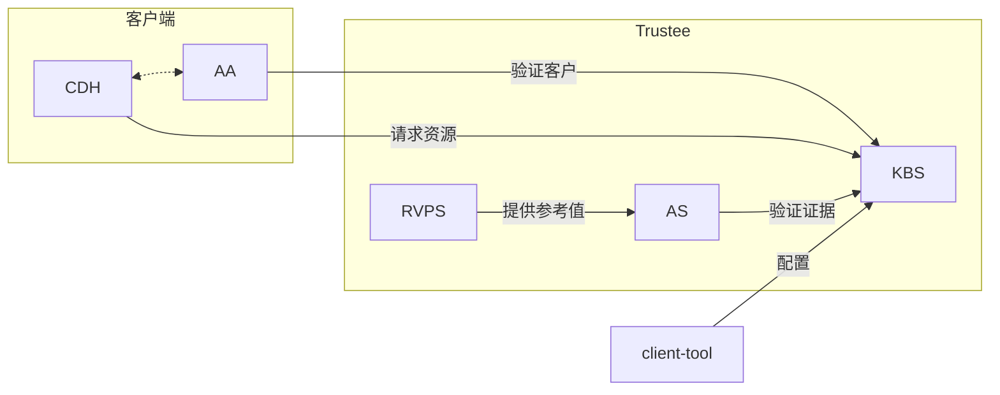

# Trustee

[](https://app.fossa.com/projects/git%2Bgithub.com%2Fconfidential-containers%2Fkbs?ref=badge_shield)

本项目包含用于验证机密计算TEE (Trust Execute Evironment) 和为其下发秘密数据的工具与组件。这些组件统称为 Trustee。Trustee 通常代表TEE所有者操作，并与 [guest-components](https://github.com/inclavare-containers/guest-components) 远程交互。

Trustee 可以广泛应用于多种应用程序和硬件平台。

## 组件

- [Key Broker Service](kbs)
  用于协助远程证明和机密数据下发。其角色类似于 RATS 模型中的 [Rely Party](https://www.ietf.org/archive/id/draft-ietf-rats-architecture-22.html#name-relying-party)。

- [Attestation Service](attestation-service)
  用于验证 TEE 证据。在 RATS 模型中，这是 [Verfier](https://www.ietf.org/archive/id/draft-ietf-rats-architecture-22.html#name-verifier)。

- [参考值提供服务 (RVPS)](rvps)
  RVPS 管理用于验证 TEE 证据的参考值。这与 RATS 文档中 [第 7.5 节](https://www.ietf.org/archive/id/draft-ietf-rats-architecture-22.html#name-endorser-reference-value-pr) 的讨论相关。

- [KBS 客户端工具](tools/kbs-client/)
  一个简单的客户端工具，可用于测试或配置 KBS 和 AS，一些场合下又称作Trustee Client。

更多详细信息，请参阅各个组件的文档。

## 架构

Trustee 灵活且可以部署在多种不同的配置中。下图展示了将这些组件与某些客户组件结合部署的一种常见方式。



## 构建

使用如下命令，在本地构建Trustee组件的容器镜像：

```shell
DOCKER_BUILDKIT=1 docker build -t kbs:latest . -f Dockerfile.kbs
DOCKER_BUILDKIT=1 docker build -t as-grpc:latest . -f Dockerfile.as-grpc
DOCKER_BUILDKIT=1 docker build -t as-restful:latest . -f Dockerfile.as-restful
DOCKER_BUILDKIT=1 docker build -t rvps:latest . -f Dockerfile.rvps
```

如果需要，使用如下命令构建KBS Client（Trustee Client）：

```shell
DOCKER_BUILDKIT=1 docker build -t trustee-client:latest . -f Dockerfile.trustee-client
```

## 部署

### Docker Compose

本仓库提供了docker compose脚本，用于一键在本地启动一个Trustee服务。

脚本中默认使用的组件容器镜像是我们发布在阿里云ACR镜像仓库上的镜像，若您需要使用自己构建的容器镜像，请修改docker compose脚本中每个容器的`image`字段为您自己的容器镜像地址。

启动Trustee服务前，需要先创建一个非对称密钥，用于表征Trustee服务所有者的身份，以在服务启动后对一些关键策略和机密数据进行配置和修改：

```shell
openssl genpkey -algorithm ed25519 > kbs/config/private.key
openssl pkey -in kbs/config/private.key -pubout -out kbs/config/public.pub
```

然后使用如下命令在本地一键拉起服务：

```shell
docker-compose up -d
```

部署完成后，Trustee会在本地监听`8080`端口和`50005`端口，分别接受并处理对 KBS Restful API 和 AS Restful API 的请求。

### 日志

可使用如下四条命令，分别查看KBS、AS (gRPC服务)、AS (RESTful服务)、RVPS的运行日志，并可从日志中查看远程证明验证结果：

```shell
docker logs openanolis-trustee-kbs-1
docker logs openanolis-trustee-as-1
docker logs openanolis-trustee-as-restful-1
docker logs openanolis-trustee-rvps-1
```

## License
[](https://app.fossa.com/projects/git%2Bgithub.com%2Fconfidential-containers%2Fkbs?ref=badge_large)


