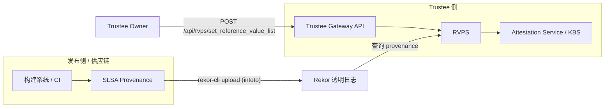
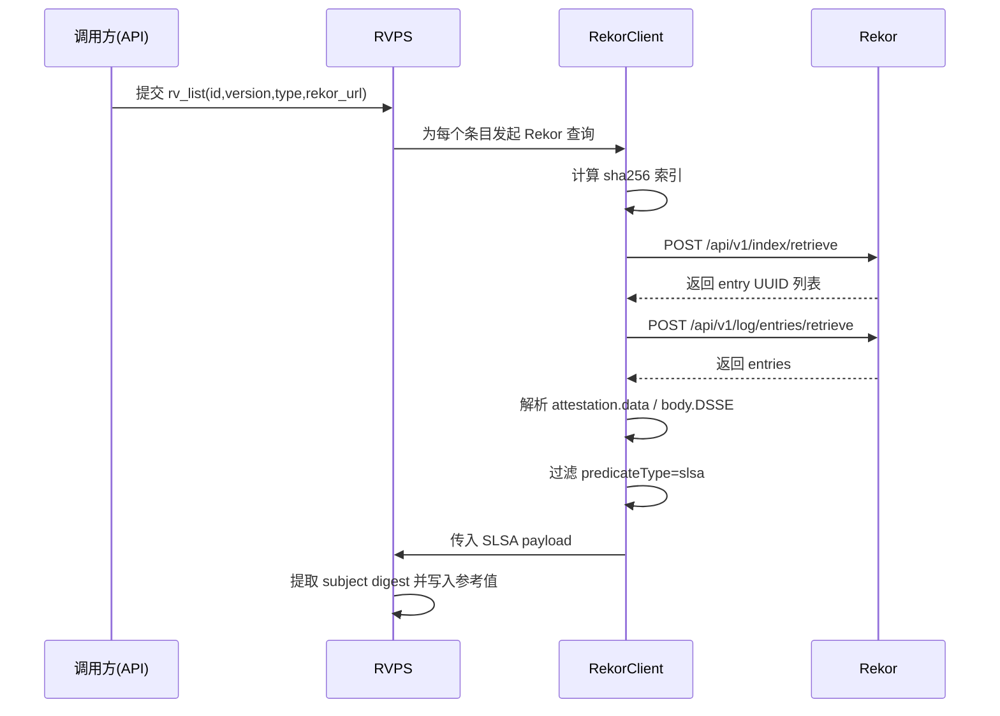

# Trustee + 透明日志（Rekor）

## 1. 概述

Trustee 已经具备比较完整的 **Rekor 透明日志参考值能力**：

- 支持从 Rekor 检索 SLSA provenance。
- 支持解析 in-toto Statement / DSSE payload，提取制品 digest。
- 支持把提取出的参考值注册到 RVPS，供后续远程证明校验。

---

## 2. 总体架构（含图）

### 2.1 组件关系图



### 2.2 关键角色

- **Rekor**：透明日志服务，存储可查询的 in-toto/SLSA 条目。
- **Trustee Gateway**：对外 API 入口，可触发 RVPS 批量设置参考值。
- **RVPS**：负责 Rekor 查询（批量场景）、SLSA 解析、digest 提取与参考值落库。
- **Attestation Service / KBS**：在证明决策中消费 RVPS 参考值。

---

## 3. 透明日志接入设计

### 3.1 Rekor 检索策略



### 3.2 解析与落库规则

- 同时兼容两种条目路径：
  - `attestation.data`（base64 JSON）
  - `body` 中 `intoto` DSSE payload（base64）
- 仅接受 `predicateType` 包含 `slsa` 的 statement。
- 从 `subject/subjects` 抽取 digest，过滤 `artifact-index-hash` 等索引项。
- 参考值支持去重与合并更新，避免重复覆盖。
- 默认设置过期时间（当前实现约 12 个月）。
- `set_reference_value_list` 的 `rv_list` 项支持可选 `rv_name`：若设置则以其为 RVPS 参考值名称，否则仍为 `measurement.<type>.<id>`。

### 3.3 可选的强化校验

RVPS 的 SLSA extractor 支持配置外部 `slsa-verifier`（通过环境变量）进行更严格校验（如 Rekor URL、builder identity、OIDC issuer）。

---

## 4. 使用方法

### 4.1 Gateway API

```bash
cat << EOF > rvps-set-list.json
{
  "rv_list": [
    {
      "id": "artifact-id",
      "version": "artifact-version",
      "type": "model",
      "provenance_info": {
        "type": "slsa-intoto-statements",
        "rekor_url": "https://log2025-1.rekor.sigstore.dev",
        "rekor_api_version": 2
      },
      "provenance_source": {
        "protocol": "oci",
        "uri": "oci://127.0.0.1:5000/trustee/provenance:v1",
        "artifact": "bundle"
      },
      "operation_type": "refresh"
    }
  ]
}
EOF

curl -k -X POST http://<gateway-host>:<port>/api/rvps/set_reference_value_list \
  -H 'Content-Type: application/json' \
  -d @rvps-set-list.json
```

说明：

- `provenance_source.protocol`：当前支持 `oci`
- `provenance_source.uri`：OCI 地址，格式 `oci://<registry>/<repo>:<tag>` 或 `oci://<registry>/<repo>@sha256:<digest>`
- `provenance_source.artifact`：`bundle` 或 `provenance`，默认建议 `bundle`
- 当请求中未提供 `provenance_source` 字段时，仍走现有 Rekor v1 索引查询兼容路径

### 4.2 发布侧：生成并上传 Rekor

```bash
cd trustee/tools/slsa
./slsa-generator \
  --artifact-type binary \
  --artifact /path/to/artifact \
  --artifact-id app-binary \
  --artifact-version 1.0.0 \
  --sign-key /path/to/cosign.key \
  --rekor-url https://log2025-1.rekor.sigstore.dev \
  --rekor-api-version 2 \
  --provenance-store-protocol oci \
  --provenance-store-uri oci://<registry>/<repo>:<tag> \
  --provenance-store-artifact bundle
```

该脚本会生成 statement + DSSE，并在 `bundle` 模式输出统一的 provenance metadata 结构：

- `sourceBundle`：来源 bundle（与 Sigstore bundle 结构对齐）；
- `dsseEnvelope`：便于直接消费的 DSSE；
- `rekorEntryV2`：可选（v2 上传成功时带上）。

同时支持：

- 上传到 Rekor v1（`rekor-cli upload --type intoto`）；
- 上传到 Rekor v2（`/api/v2/log/entries`，`dsseRequestV002`）；
- 把 provenance 元数据上传到指定存储地址（首期支持 OCI）。

> 说明：CI 发布到 GitHub Release 的 `*.provenance-metadata.json` 与 `slsa-generator` 的 `provenance.trustee-bundle.json` 已统一为同一 schema（`sourceBundle + dsseEnvelope + rekorEntryV2`）。

### 4.3 审计侧：使用脚本验证参考值与 Rekor v2 一致性

当审计者已拿到 `provenance_source.protocol` 和 `provenance_source.uri` 时，可直接使用脚本：

`tools/slsa/audit_reference_value_v2.py`

示例：

```bash
cd trustee/tools/slsa
./audit_reference_value_v2.py \
  --reference-id demo-artifact-v2 \
  --reference-version 1.0.0 \
  --reference-value 3c8b9c3566c89593595c9604b7855abbb07cbb1e4d5e586a06b9407e88b637e3 \
  --provenance-source-protocol oci \
  --provenance-source-uri oci://127.0.0.1:5000/trustee/provenance:demo-artifact-v2 \
  --provenance-source-artifact bundle \
  --verbose-http
```

脚本会在终端输出完整审计过程，并给出 PASS/FAIL 结果，覆盖：

1. 参考值与 statement 中 `subject(name=id).digest.sha256` 一致；
2. DSSE payload 摘要与 Rekor v2 `canonicalizedBody.spec.dsseV002` 一致；
3. 校验 proof checkpoint 与 latest checkpoint 的签名（基于 Sigstore trusted root）；
4. 通过 `logIndex + tile` 验证 entry 确实存在于透明日志；
5. 通过 inclusion proof 验证 entry 包含于已签名树根；
6. append-only 严格校验：
   - 首次运行：建立 checkpoint 基线；
   - 后续运行：对“上次 checkpoint”和“本次 checkpoint”执行树根重构比对，确认无回滚/分叉。

说明：

- 默认 checkpoint 状态文件：`~/.cache/trustee-rekor-audit/<origin>.json`
- 可通过 `--state-file` 指定自定义状态文件路径；
- 可通过 `--trusted-root-url` 指定 trusted root JSON（默认使用 Sigstore root-signing 仓库）；
- `--verbose-http` 会打印访问 Rekor v2/OCI 的具体 URL，便于审计留痕；
- 当前 provenance source 协议实现为 `oci`。

---

## 5. 审计者验证指南（v1 / v2）

### 5.1 审计目标（两代通用）

审计者通常需要确认三件事：

1. 某项参考值（或其 provenance/attestation）在透明日志里确实存在对应 entry；
2. 该 entry 确实被包含在日志某个已签名树根（checkpoint）中（包含性证明）；
3. 日志从上次观测到当前保持 append-only（无回滚/分叉，一致性证明）。

### 5.2 Rekor v1：基于 `rekor-cli` 的审计

Rekor v1 可以直接使用 `rekor-cli` 完成端到端审计。

```bash
# 0) 目标日志
REKOR_URL="https://rekor.sigstore.dev"

# 1) 先按 hash 搜索候选 entry（示例：制品 sha256）
ARTIFACT_SHA256="<artifact-sha256-hex>"
rekor-cli search --rekor_server "${REKOR_URL}" --sha "${ARTIFACT_SHA256}"

# 2) 按 UUID 或 log index 拉取 entry，确认“确实存在”
UUID="<uuid-from-search>"
rekor-cli get --rekor_server "${REKOR_URL}" --uuid "${UUID}"

# 3) 验证包含性 + 条目内容（示例：intoto 类型）
# 需要提供与条目对应的 artifact / signature / public-key（或等价材料）
rekor-cli verify \
  --rekor_server "${REKOR_URL}" \
  --uuid "${UUID}" \
  --type intoto \
  --artifact /path/to/artifact \
  --signature /path/to/signature \
  --public-key /path/to/public.key

# 4) append-only（一致性）检查
# 记录上次和本次树大小，获取一致性证明材料
OLD_SIZE="<old-tree-size>"
NEW_SIZE="<new-tree-size>"
rekor-cli logproof \
  --rekor_server "${REKOR_URL}" \
  --first-size "${OLD_SIZE}" \
  --last-size "${NEW_SIZE}"
```

说明：

- v1 的优势是：检索、包含性验证、一致性证明都能由 `rekor-cli` 统一覆盖；
- 实际生产中可结合周期性采集 `loginfo`/`logproof` 做持续审计。

### 5.3 Rekor v2：基于 entry + checkpoint + tiles 的审计

Rekor v2 的模型与 v1 不同：**写接口是 `/api/v2/log/entries`，读侧基于 checkpoint + tile API**。  
因此通常不再依赖 `rekor-cli search/get` 这种“索引检索式”审计流程，而是按下述三步完成。

#### 5.3.1 目标1：entry 存在性（存在于日志索引位置）

输入材料（建议随制品/metadata 一起持久化）：

- `logIndex`
- `canonicalizedBody`
- `inclusionProof`（至少包含 `treeSize`、`rootHash`、`hashes`）

最小验证思路：

1. 由 `canonicalizedBody` 计算 leaf hash（RFC6962 叶子哈希：`SHA256(0x00 || canonicalizedBody_bytes)`）；
2. 按 `logIndex` 定位 level-0 tile（`/tile/0/...`）中的对应位置；
3. 对比 tile 里的 leaf hash 与本地计算值一致，即可确认“该条目确实在日志里占有该索引位置”。

#### 5.3.2 目标2：包含性证明（entry 包含在某个已签名树根）

验证步骤：

1. 使用 `inclusionProof.hashes` + `logIndex` + leaf hash，按 RFC6962 规则回放路径，得到计算根；
2. 与 `inclusionProof.rootHash` 比较，应一致；
3. 使用 `inclusionProof.checkpoint.envelope`（已签名 checkpoint）验证签名与 `treeSize/rootHash` 对应关系。

> 第 3 步建议使用 Sigstore 官方信任根（TUF 分发）中的 Rekor 公钥做签名校验。

#### 5.3.3 目标3：append-only（一致性证明）

v2 一致性验证是“**旧 checkpoint -> 新 checkpoint**”的 consistency proof 校验。流程为：

1. 保存上次可信 checkpoint（`size_old`, `root_old`）；
2. 获取当前 checkpoint（`size_new`, `root_new`）；
3. 通过 tile API 拉取所需 Merkle 节点，构造并验证 consistency proof；
4. 校验通过则说明日志从 old 到 new 仅追加、无回滚/分叉。

实践建议：

- 该流程建议使用专用审计器（如 `rekor-monitor`/`omniwitness` 或基于 `sigstore-go` 的校验代码）自动化执行；
- v2 更推荐“持续监控 + 本地保存 checkpoint 状态”，而不是临时手工查单条。

#### 5.3.4 与 Trustee 的对应关系

- Trustee 在 v2 路径中会保存/消费 `rekorEntryV2` 与 DSSE 内容并做摘要一致性校验；
- 对外部独立审计者，建议复用同一份 bundle/metadata 做“存在性 + 包含性 + 一致性”三层验证，形成可复验审计链路。

---

## 6. 源码与文档链接清单

### 6.1 透明日志访问核心代码

- [RVPS Rekor 客户端实现](../rvps/src/rekor.rs)
- [RVPS 批量设置参考值主逻辑（含 Rekor 查询）](../rvps/src/lib.rs)
- [RVPS `rv_list` 数据结构与解析](../rvps/src/rv_list/mod.rs)
- [SLSA digest 提取逻辑](../rvps/src/rv_list/slsa_parse.rs)

### 6.2 对外接口与使用文档

- [Gateway API 文档（`set_reference_value_list`）](../trustee-gateway/trustee_gateway_api.md)
- [SLSA 生成与上链工具说明](../tools/slsa/README.md)
