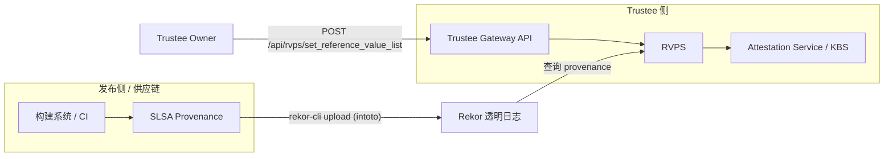
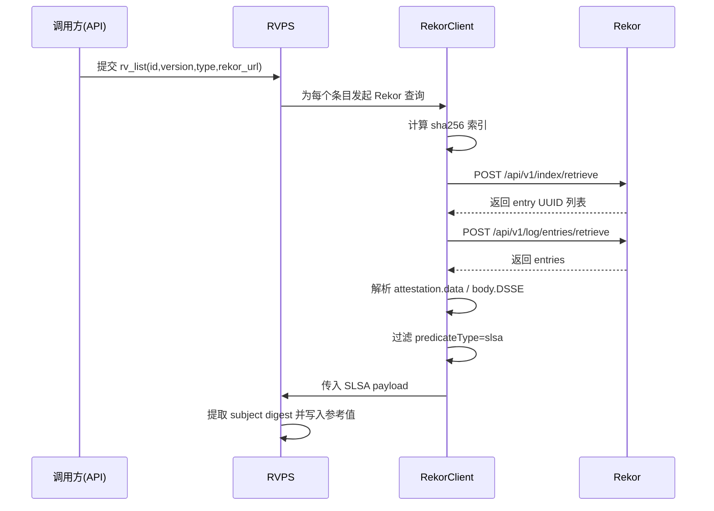

# Trustee + 透明日志（Rekor）

## 1. 概述

Trustee 已经具备比较完整的 **Rekor 透明日志参考值能力**：

- 支持从 Rekor 检索 SLSA provenance。
- 支持解析 in-toto Statement / DSSE payload，提取制品 digest。
- 支持把提取出的参考值注册到 RVPS，供后续远程证明校验。

---

## 2. 总体架构（含图）

### 2.1 组件关系图



### 2.2 关键角色

- **Rekor**：透明日志服务，存储可查询的 in-toto/SLSA 条目。
- **Trustee Gateway**：对外 API 入口，可触发 RVPS 批量设置参考值。
- **RVPS**：负责 Rekor 查询（批量场景）、SLSA 解析、digest 提取与参考值落库。
- **Attestation Service / KBS**：在证明决策中消费 RVPS 参考值。

---

## 3. 透明日志接入设计

### 3.1 Rekor 检索策略



### 3.2 解析与落库规则

- 同时兼容两种条目路径：
  - `attestation.data`（base64 JSON）
  - `body` 中 `intoto` DSSE payload（base64）
- 仅接受 `predicateType` 包含 `slsa` 的 statement。
- 从 `subject/subjects` 抽取 digest，过滤 `artifact-index-hash` 等索引项。
- 参考值支持去重与合并更新，避免重复覆盖。
- 默认设置过期时间（当前实现约 12 个月）。
- `set_reference_value_list` 的 `rv_list` 项支持可选 `rv_name`：若设置则以其为 RVPS 参考值名称，否则仍为 `measurement.<type>.<id>`。

### 3.3 可选的强化校验

RVPS 的 SLSA extractor 支持配置外部 `slsa-verifier`（通过环境变量）进行更严格校验（如 Rekor URL、builder identity、OIDC issuer）。

---

## 4. 使用方法

### 4.1 Gateway API

```bash
cat << EOF > rvps-set-list.json
{
  "rv_list": [
    {
      "id": "artifact-id",
      "version": "artifact-version",
      "type": "model",
      "provenance_info": {
        "type": "slsa-intoto-statements",
        "rekor_url": "https://rekor.sigstore.dev"
      },
      "operation_type": "add"
    }
  ]
}
EOF

curl -k -X POST http://<gateway-host>:<port>/api/rvps/set_reference_value_list \
  -H 'Content-Type: application/json' \
  -d @rvps-set-list.json
```

### 4.2 发布侧：生成并上传 Rekor

```bash
cd trustee/tools/slsa
./slsa-generator \
  --artifact-type binary \
  --artifact /path/to/artifact \
  --artifact-id app-binary \
  --artifact-version 1.0.0 \
  --sign-key /path/to/cosign.key
```

该脚本会生成 statement + DSSE 并调用 `rekor-cli upload --type intoto` 上传到 Rekor。

---

## 5. 源码与文档链接清单

### 5.1 透明日志访问核心代码

- [RVPS Rekor 客户端实现](../rvps/src/rekor.rs)
- [RVPS 批量设置参考值主逻辑（含 Rekor 查询）](../rvps/src/lib.rs)
- [RVPS `rv_list` 数据结构与解析](../rvps/src/rv_list/mod.rs)
- [SLSA digest 提取逻辑](../rvps/src/rv_list/slsa_parse.rs)

### 5.2 对外接口与使用文档

- [Gateway API 文档（`set_reference_value_list`）](../trustee-gateway/trustee_gateway_api.md)
- [SLSA 生成与上链工具说明](../tools/slsa/README.md)
